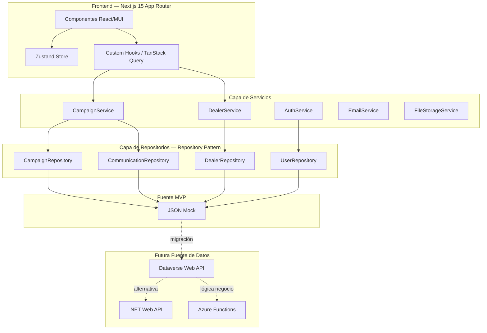
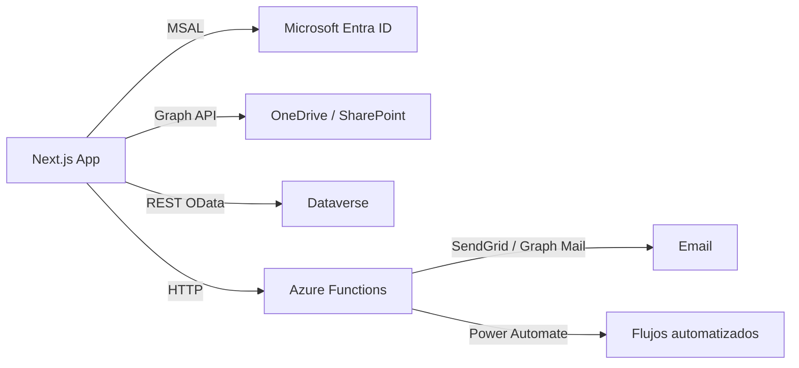

# Arquitectura del Sistema

## Visión General



## Capas de la Arquitectura

| Capa | Archivos | Responsabilidad |
|---|---|---|
| UI | `components/**` | Renderizado, interacción usuario |
| State | `store/**` | Estado UI local (modales, usuario) |
| Data Fetching | `hooks/**` | Cache servidor, sincronización |
| Business Logic | `services/**` | Reglas de negocio, orquestación |
| Data Access | `repositories/**` | Acceso y abstracción de datos |
| Data Source | `mocks/*.json` | Datos en MVP (reemplazable) |

## Flujo de una Operación (Crear Campaña)

```
1. Usuario llena formulario CampaignFormModal
2. handleSubmit → validateSimilar (CampaignService)
3. Si similar: muestra Alert de advertencia
4. Confirma → CampaignService.create()
5. CampaignService → CampaignRepository.create()
6. Repository actualiza store in-memory (MVP) / llamada HTTP (producción)
7. TanStack Query invalida cache ['campaigns']
8. CalendarView recibe datos frescos y re-renderiza
9. Nuevo evento aparece en el calendario
```

## Flujo de Datos (Lectura)

```
CalendarView
  → useCampaigns() [TanStack Query]
    → CampaignService.getAll()
      → CampaignRepository.findAll() [JSON store]
      → CommunicationRepository.findAll() [JSON store]
    ← Campaign[] con comunicaciones hidratadas
  ← eventos mapeados para FullCalendar
```

## Integración Futura Microsoft Stack



## Decisión: Repository Pattern

El Repository Pattern permite cambiar la fuente de datos sin modificar ningún componente de UI.

**MVP:** `CampaignRepository` lee de `campaigns.json` en memoria.

**Producción:** Reemplazar el cuerpo de `findAll()`, `create()`, etc. con llamadas HTTP a Dataverse o .NET API. La interfaz pública no cambia.

```typescript
// MVP
async findAll(): Promise<Campaign[]> {
  return structuredClone(store) // store = JSON importado
}

// Producción (Dataverse)
async findAll(): Promise<Campaign[]> {
  const res = await fetch(`${DATAVERSE_URL}/cr_campaigns`, {
    headers: { Authorization: `Bearer ${token}` }
  })
  const { value } = await res.json()
  return value.map(mapDataverseToCampaign)
}
```
