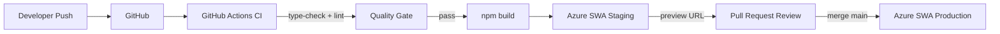

# Despliegue en Azure

## Opción 1: Azure Static Web Apps (Recomendado para MVP)

Ideal para Next.js con App Router. Incluye API Routes como Azure Functions automáticamente.

### GitHub Actions

```yaml
# .github/workflows/azure-static-web-apps.yml
name: Deploy to Azure Static Web Apps

on:
  push:
    branches: [main]
  pull_request:
    types: [opened, synchronize, reopened, closed]
    branches: [main]

jobs:
  build_and_deploy:
    if: github.event_name == 'push' || (github.event_name == 'pull_request' && github.event.action != 'closed')
    runs-on: ubuntu-latest
    steps:
      - uses: actions/checkout@v4

      - name: Setup Node.js
        uses: actions/setup-node@v4
        with:
          node-version: '20'
          cache: 'npm'

      - name: Install dependencies
        run: npm ci

      - name: Build
        run: npm run build

      - name: Deploy
        uses: Azure/static-web-apps-deploy@v1
        with:
          azure_static_web_apps_api_token: ${{ secrets.AZURE_STATIC_WEB_APPS_API_TOKEN }}
          repo_token: ${{ secrets.GITHUB_TOKEN }}
          action: 'upload'
          app_location: '/'
          api_location: ''
          output_location: '.next'
```

### Configuración en Azure Portal

1. Crear **Static Web App** en Azure Portal
2. Vincular con repositorio GitHub
3. Configurar variables de entorno en:
   `Static Web App → Configuration → Application Settings`

| Key | Descripción |
|---|---|
| `NEXT_PUBLIC_AZURE_CLIENT_ID` | Client ID de la aplicación Entra ID |
| `NEXT_PUBLIC_AZURE_TENANT_ID` | Tenant ID de la organización |
| `NEXT_PUBLIC_REDIRECT_URI` | URL de la app desplegada |
| `SENDGRID_API_KEY` | Clave API de SendGrid |
| `EMAIL_FROM` | Email remitente |
| `DATAVERSE_URL` | URL del entorno Dataverse |
| `NEXT_PUBLIC_SHAREPOINT_SITE` | ID del sitio SharePoint |

## Opción 2: Azure App Service

Para control total sobre el servidor Node.js.

```bash
# Crear App Service plan
az appservice plan create \
  --name calendario-plan \
  --resource-group calendario-rg \
  --sku B2 \
  --is-linux

# Crear Web App
az webapp create \
  --name calendario-comunicaciones \
  --resource-group calendario-rg \
  --plan calendario-plan \
  --runtime "NODE:20-lts"

# Configurar startup command
az webapp config set \
  --name calendario-comunicaciones \
  --resource-group calendario-rg \
  --startup-file "node server.js"

# Deploy
az webapp deploy \
  --name calendario-comunicaciones \
  --resource-group calendario-rg \
  --src-path ./dist.zip \
  --type zip
```

## Opción 3: Azure Container Apps

Para arquitectura containerizada.

```dockerfile
# Dockerfile
FROM node:20-alpine AS builder
WORKDIR /app
COPY package*.json ./
RUN npm ci
COPY . .
RUN npm run build

FROM node:20-alpine AS runner
WORKDIR /app
ENV NODE_ENV=production
COPY --from=builder /app/.next/standalone ./
COPY --from=builder /app/.next/static ./.next/static
COPY --from=builder /app/public ./public
EXPOSE 3000
CMD ["node", "server.js"]
```

```bash
# Build y push imagen
az acr build \
  --registry miRegistro \
  --image calendario-comunicaciones:latest .

# Crear Container App
az containerapp create \
  --name calendario-comunicaciones \
  --resource-group calendario-rg \
  --image miRegistro.azurecr.io/calendario-comunicaciones:latest \
  --target-port 3000 \
  --ingress external
```

## Azure Functions (API Backend Futuro)

Cuando la lógica de negocio crezca, mover las API Routes a Azure Functions:

```
/api/campaigns     → HttpTrigger (Node.js)
/api/send-email    → HttpTrigger + SendGrid binding
/api/dealers       → HttpTrigger
```

```typescript
// campaigns/index.ts (Azure Function v4)
import { app, HttpRequest, HttpResponseInit, InvocationContext } from '@azure/functions'

app.http('campaigns', {
  methods: ['GET', 'POST'],
  authLevel: 'anonymous',
  handler: async (request: HttpRequest, context: InvocationContext): Promise<HttpResponseInit> => {
    if (request.method === 'GET') {
      const campaigns = await CampaignRepository.findAll()
      return { jsonBody: { data: campaigns, success: true } }
    }
    // ... POST handler
  },
})
```

## Pipeline CI/CD Completo



## Monitoreo

```typescript
// Agregar Application Insights (producción)
// npm install @microsoft/applicationinsights-web

import { ApplicationInsights } from '@microsoft/applicationinsights-web'

const appInsights = new ApplicationInsights({
  config: {
    connectionString: process.env.NEXT_PUBLIC_APPINSIGHTS_CONNECTION_STRING,
  },
})
appInsights.loadAppInsights()
appInsights.trackPageView()
```
