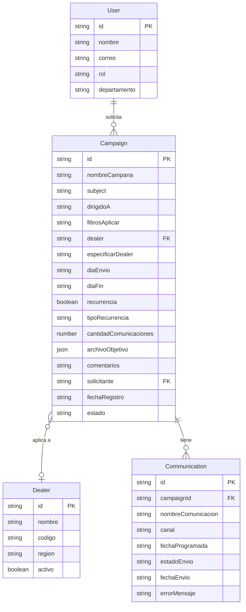

# Modelo de Datos

## Diagrama ER



## Entidades TypeScript

### User
```typescript
interface User {
  id: string              // "usr-001"
  nombre: string          // "Ana García Ríos"
  correo: string          // "ana.garcia@empresa.com"
  rol: 'admin' | 'editor' | 'viewer'
  departamento?: string   // "Marketing"
}
```

### Dealer
```typescript
interface Dealer {
  id: string              // "dlr-001"
  nombre: string          // "AutoMundo Lima"
  codigo: string          // "AML-01"
  region?: string         // "Lima"
  activo: boolean         // true
}
```

### Campaign
```typescript
interface Campaign {
  id: string
  nombreCampana: string
  subject: string
  dirigidoA: string
  filtrosAplicar: string
  dealer: string | null          // Dealer.id o null
  especificarDealer?: string
  diaEnvio: string               // ISO date "2026-07-25"
  diaFin: string                 // ISO date "2026-07-31"
  recurrencia: boolean
  tipoRecurrencia?: 'Diario' | 'Semanal' | 'Mensual' | 'Trimestral' | 'Anual'
  cantidadComunicaciones: number
  archivoObjetivo?: {
    nombre: string
    tamaño: number               // bytes
    fechaCarga: string           // ISO datetime
    archivoId?: string           // futuro OneDrive
    archivoUrl?: string          // futuro OneDrive
  }
  comentarios?: string
  solicitante: string            // User.id
  fechaRegistro: string          // ISO datetime
  estado: 'Pendiente' | 'Aprobada' | 'Rechazada' | 'Ejecutada' | 'Cancelada'
  comunicaciones?: Communication[]
}
```

### Communication
```typescript
interface Communication {
  id: string
  campaignId: string             // Campaign.id
  nombreComunicacion: string
  canal: 'Email' | 'SMS' | 'Push' | 'WhatsApp'
  fechaProgramada: string        // ISO datetime
  estadoEnvio: 'Pendiente' | 'Programado' | 'Enviado' | 'Error' | 'Cancelado'
  fechaEnvio?: string
  errorMensaje?: string
}
```

## Datos de Ejemplo

### campaigns.json (extracto)
```json
{
  "id": "cmp-001",
  "nombreCampana": "Lanzamiento Sedán 2025",
  "subject": "Descubre el nuevo Sedán 2025 - Oferta exclusiva",
  "dirigidoA": "Clientes activos con compras >$30,000",
  "filtrosAplicar": "Edad 30-55, ingreso medio-alto, región Lima",
  "dealer": "dlr-001",
  "especificarDealer": "AutoMundo Lima",
  "diaEnvio": "2026-07-25",
  "diaFin": "2026-07-31",
  "recurrencia": false,
  "cantidadComunicaciones": 1,
  "archivoObjetivo": {
    "nombre": "Clientes_Sedan_Lima.xlsx",
    "tamaño": 245760,
    "fechaCarga": "2026-07-22T10:00:00.000Z"
  },
  "solicitante": "usr-001",
  "fechaRegistro": "2026-07-22T10:00:00.000Z",
  "estado": "Aprobada"
}
```

## Tablas Dataverse Sugeridas (Migración Futura)

| Entidad | Tabla Dataverse | Prefijo |
|---|---|---|
| Campaign | cr_campaign | cr_ |
| Communication | cr_communication | cr_ |
| Dealer | cr_dealer | cr_ |
| User | systemuser | (nativa) |

## Mapeo de Campos a Dataverse

| Campo TypeScript | Campo Dataverse | Tipo |
|---|---|---|
| id | cr_campaignid | Guid (PK) |
| nombreCampana | cr_nombrecampana | Text |
| subject | cr_subject | Text |
| estado | cr_estado | OptionSet |
| diaEnvio | cr_diaenvio | Date |
| diaFin | cr_diafin | Date |
| solicitante | _ownerid_value | Lookup(systemuser) |
| dealer | _cr_dealerid_value | Lookup(cr_dealer) |
